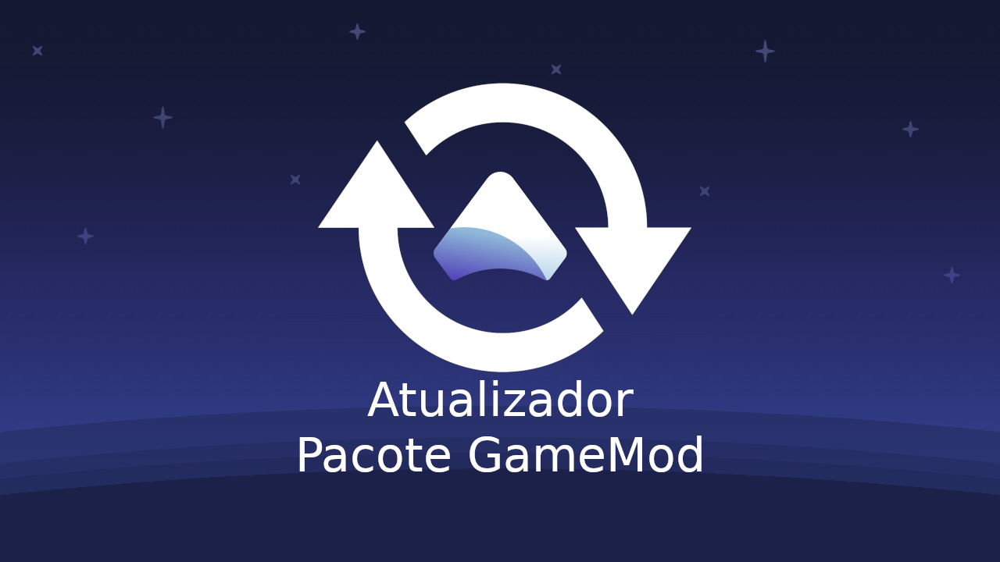

<h1 align="center">APG - Atualizador Pacote GameMod</h1>

Um homebrew de Nintendo Switch, baseado no homebrew [AIO-Switch-Updater](https://github.com/HamletDuFromage/aio-switch-updater/), altamente modificado, para fazer o download e atualizar firmwares e o custom firmware [GMPACK](https://github.com/gamemoddesignbr/gmpack/releases).

GMPACK é um pacote all-in-one (tudo em um) baseado no custom firmware Atmosphère que inclui o hekate/nyx e vários outros homebrews. Assim como o Atmosphère ele não contém arquivos que habilitam pirataria!

Este homebrew suporta Atmosphère e funciona em consoles não corrigidos (`Erista`) and corrigidos (`Mariko`).

## **[FAÇA O DOWNLOAD POR AQUI!](https://github.com/gamemoddesignbr/gmpack-updater/releases)**

## Como instalar?
Baixe o arquivo `gmpack-updater.zip` do link acima e o extraia na `raiz` do microSD.
No final você deve ter uma pasta `gmpack-updater` dentro da pasta `/switch`.

## Onde achar o homebrew e como iniciá-lo?
Abra a lista de homebrews do seu desbloqueio (no `Atmosphère` é o botão do `Album`) e execute o homebrew `Atualizador Pacote GameMod` (também conhecido por `APG`).
Se você estiver com dúvidas de como usar o homebrew, aperte o botão `X` e uma janela de ajuda irá aparecer.

## Descrição das funções
### ⬦ Baixar Atmosphère
- Baixa o pacote (`GMPACK`).
  - Opcionalmente, também é possível baixar pacotes alternativos.
-  Após baixado, o programa irá instalar o pacote para você.

### ⬦ Baixar firmwares
- Baixa os arquivos do firmware para a pasta `/firmware` que, posteriormente, podem ser instalados usando o homebrew Daybreak.

### ⬦ Baixar traduções
- As traduções são feitas por membros da cena e tem a finalidade de distribuir acessibilidade linguística aos jogos.
- Algumas traduções precisam de passos específicos para que funcionem. Para maiores detalhes consulte os sites dos criadores das legendas:
  - https://www.jumpmanclubbrasil.com.br/
  - https://traducoespkg.tumblr.com/
  - https://nintendonxbr.blogspot.com/

### ⬦ Baixar modificações
- As modificações de jogos, também conhecidos por MODS, são feitas por membros da cena e tem a diversas finalidades. Vão desde melhorias gráficas até trapaças (cheats) ou trainers (uma espécie de trapaça adicionada quando o jogo não vem com trapaça "de fábrica".
- Algumas modificaçõs precisam de passos específicos para que funcionem. Para maiores detalhes pesquise online sobre tais modificações e procure se inteirar sobre a mesma.

### ⬦ Extras (na página `Ferramentas`)
- Editar as configurações da internet (DNS, endereço IP, MTU, etc). Adicione suas próprias configurações em `config/aio-switch-updater/internet.json`. Você vai achar um modelo desta configuração neste repositório.
- Abrir o navegador de internet do Switch (precisa abrir o APG em modo título/title usando um jogo e pressionar R).
- Limpar os arquivos temporários baixados.
- Abrir a última mensagem do dia (MOTD) disponível no servidor (quando disponível).
- Consultar as alterações sofridas pelo homebrew (changelog).

## Aviso legal
A GameMod design não detém nenhum direito de cópia sobre nenhum arquivo baixado por este homebrew e todo o crédito pertence aos seus respectivos proprietários. Se o atual proprietário do arquivo baixado por este atualizador solicitar a remoção, removeremos imediatamente deste homebrew a habilidade de baixar tal arquivo.
- O GMPACK, assim como o Atmosphère, não habilita a pirataria no console e seu propósito principal é somente habilitar o usuário a rodar homebrews.
- O uso do GMPACK com o propósito diferente do mencionado acima, como rodar cópias (backup) de jogos originais, é parcial ou totalmente proibida pela legislação de certos países.
- Ao usar o GMPACK você está declarando ter consultado sua legislação local e estar legalmente apto a usá-los com o propósito de rodar cópias (backup) dos seus jogos originais.
- Você está declarando também ser o dono de todos os jogos originais dos quais você fez, faz ou fará cópias (backup).
- O uso do GMPACK com o propósito diferente do que é permitido pela sua legislação local será feito sob a sua inteira responsabilidade, isentando-se assim a GameMod design.
- A GameMod design não comercializa ou instala backup de jogos, ROMs de emuladores nem nenhum conteúdo que habilita a pirataria!
- A GameMod design condena a pirataria. Apoie os desenvolvedores de jogos!

## Agradecimentos especiais
- [HamletDuFromage](https://github.com/HamletDuFromage/) pelo brilhante homebew AIO-Switch-Updater.
- [natinusala](https://github.com/natinusala) pela biblioteca Borealis.
- [Team Neptune](https://github.com/Team-Neptune) pelo código RCM usado.
- [CostelaBR](https://github.com/AMSNX) pela sugestão da função de baixar traduções.

## 📝 Licença

O nome Nintendo Switch e logo são marcas registradas de [Nintendo](https://github.com/Nintendo). Este repositório não é afiliado a [Nintendo](https://github.com/Nintendo) ou nenhum dos seus parceiros.

The Nintendo Switch names and logos are a trademark of [Nintendo](https://github.com/Nintendo). This repository is in no way affiliated with [Nintendo](https://github.com/Nintendo) or any of its partners.
